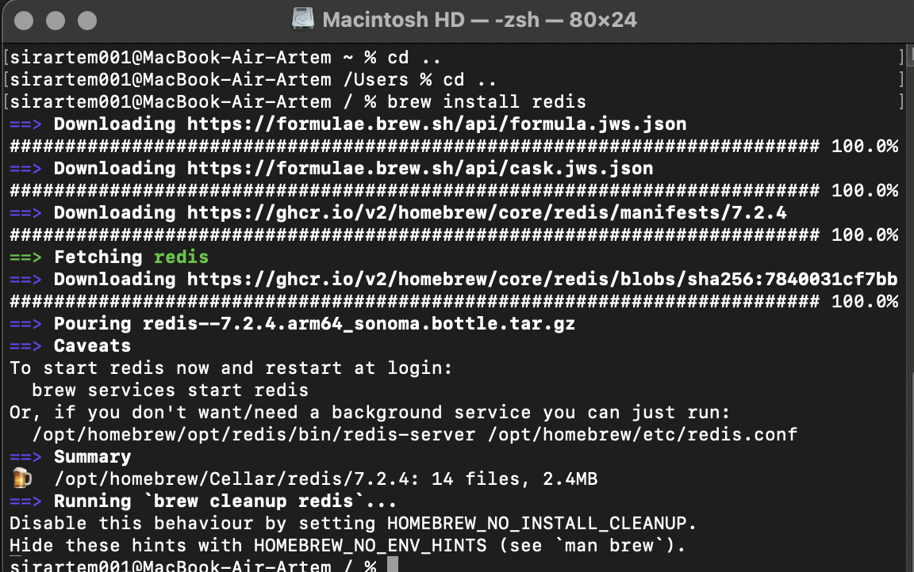
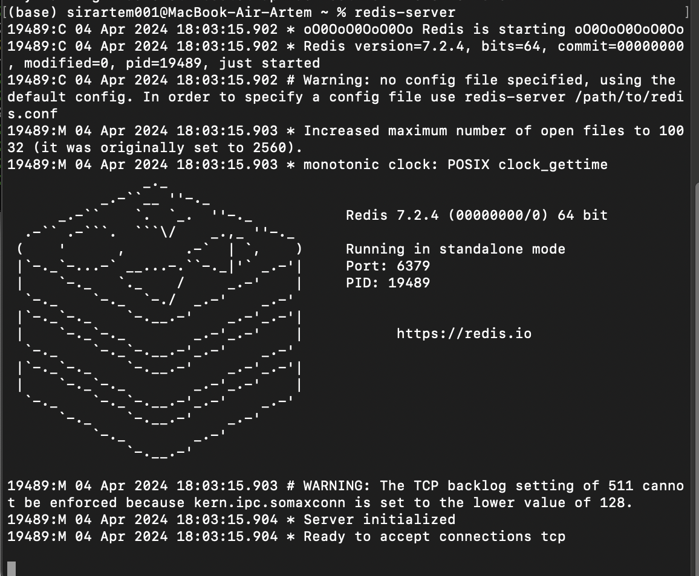
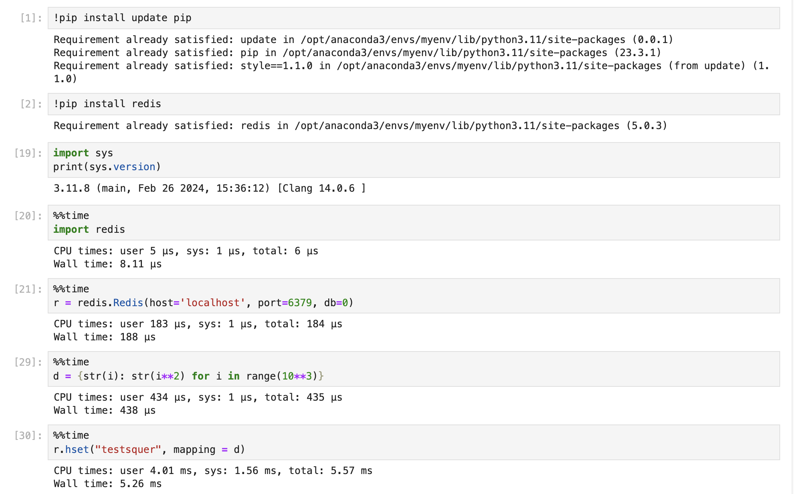
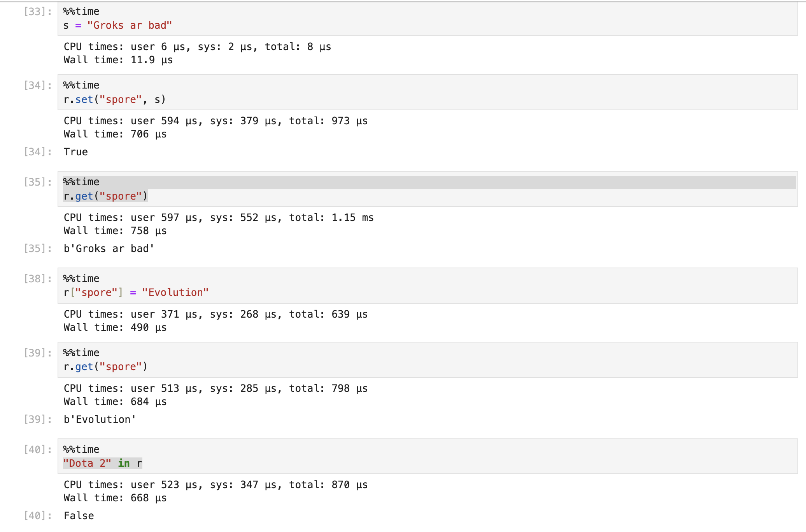
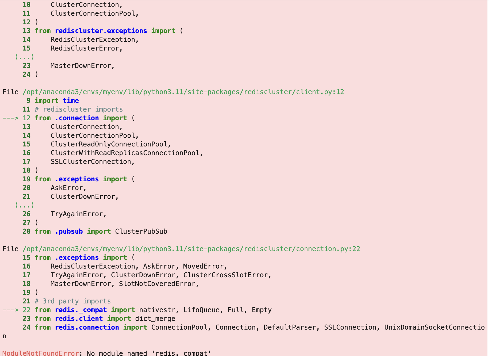
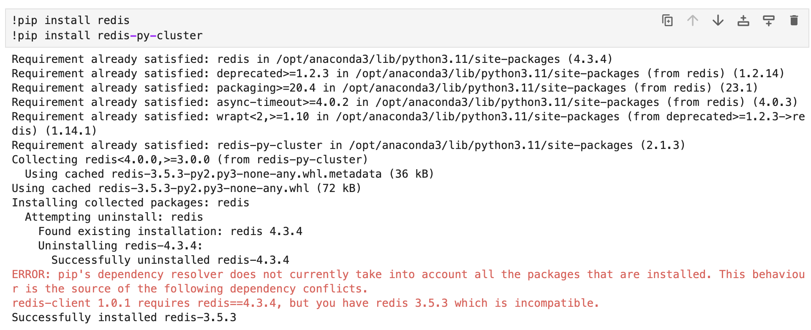

# Redis и Radis-cluster

## Установка

Я работаю на маке. Чтобы установить редис нужна одна команда brew install redis. Самым тяжелым было разобраться, как поменять версию интерпритатора в Jupiter. Это было необходимо, потому что pip  автоматом грузит в python 3.11, хотя это не новейшая версия. Пришлось [разобраться](https://www.youtube.com/watch?v=VINuDIs6Mf4) как создавать свое ядро в Jupiter. Дальше все было просто.

Запускаем сервер

## Команды на Redis

На Jupiter легко получать время выполнения команды. И в целом редис удобно использовать в связке с питоном.

## Команды на Redis-cluster

Не получилось разобраться с Redis-cluster. Почему-то библиотека не хотела импортироваться. Я перерыл весь StackOverflow, но не нашел как это исправить.

Когда я устанавливал новейшую версию редиса, она устанавливалась без проблем. Но при установке кластера даунгрейдилась. 

## Итоги

Redis очень удобный в использовании. Особенно мне понравилась апишка для python, потому что можно писать как на. обычном питоне. Для использования не нужно никаких настроек, можно просто залететь и быстро все сделать. Обидно, что не получилось разобраться с кластерами, но думаю я дальше буду пытаться найти ответ, потому что мне очень зашла эта субд. Если знаете как такое пофиксить, подаскажите, пожалуйста. 
