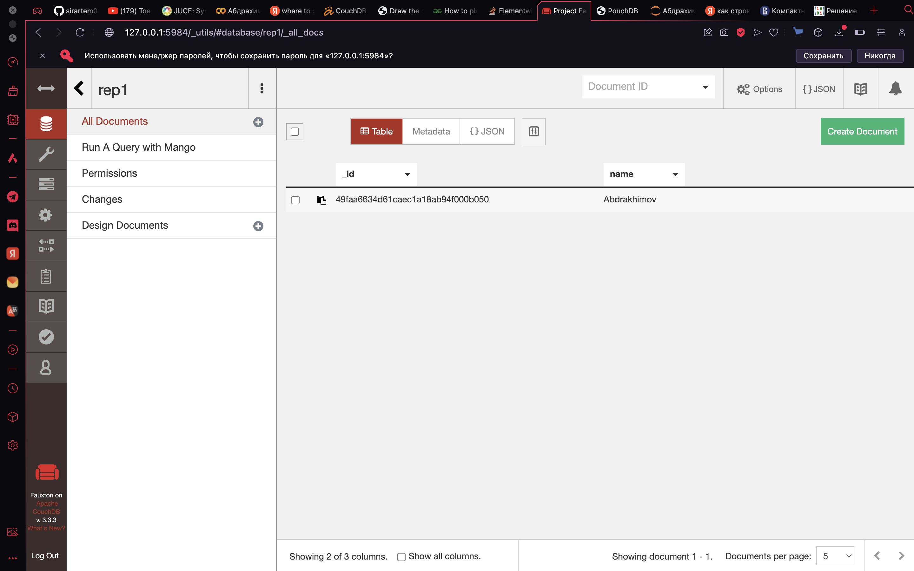
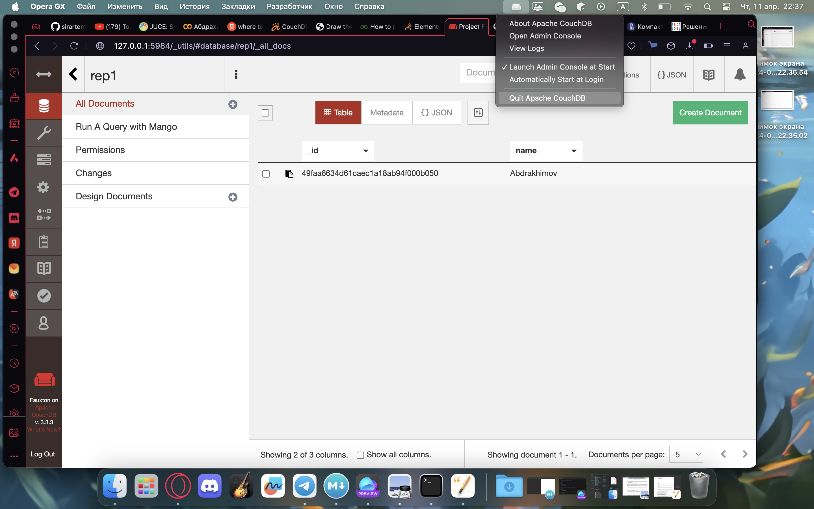

## Домашнее задание 3. CouchDB
Я устанавливал CouchDB с официального сайта().
Дальше я скачал файл. Cors были выключены по дефолту, и без них не работало. Потом, я понял, что нужно указывать логин и пароль, при указании инсталяции, чтобы все работало корректно. Html файлы можно посмотреть в папке Utils. Я создал свою базу данных и вставил в нее файл.

Дальше, я отключил CouchDB. 

И проверил, что локальная база данных работает.

### Вывод
Я не очень хорошо разбираюсь в html, но по ощущениям, CouchDB очень легко имплементируется в вебприложения. Интерфейс Apache CouchDB очень приятный. Если когда-нибудь буду писать вебприложение обязательно попробую использовать эту СУБД.
