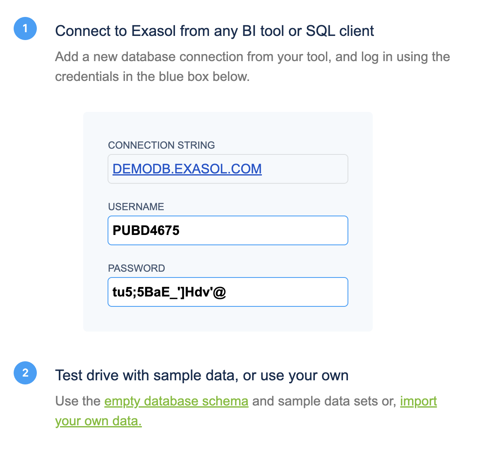
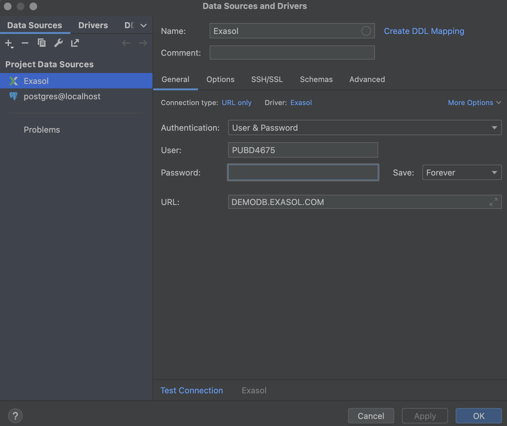
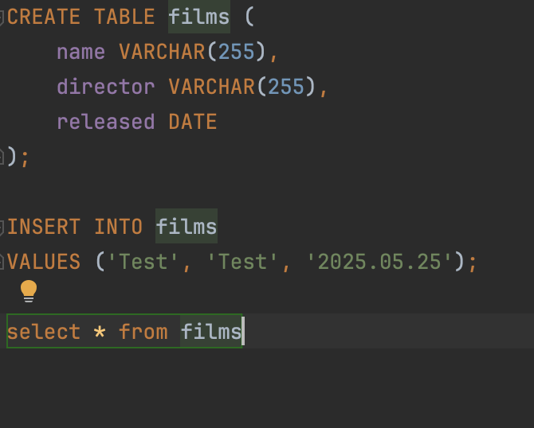
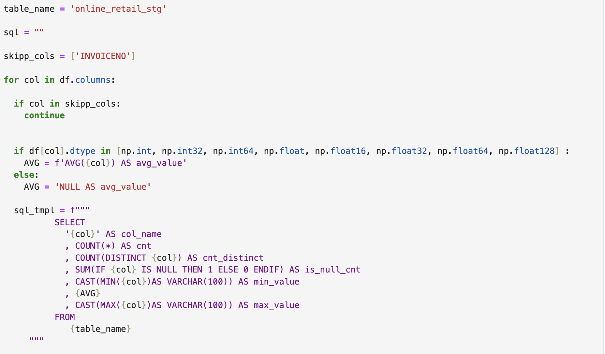

Exasol - это реляционная in-memory база данных для быстрой аналитики. [Здесь ссылка на сайт](https://www.exasol.com). 

### 1. Как проходило мое знакомство с Exasol
Все началось с того, что я не нашел бесплатной версии на официальном сайте. Пока я копался там, нашлась опция созвона с экспертом, я было уже подумал, что эта домашка будет простой, за 20 минут мне все покажут и расскажут. Однако, экспертом оказался стажер отдела продаж и он не смог мне выдать никакой полезной информации даже про свои продукты. Сайт очень перегружен информацией, при этом, что-то полезное тяжело найти. Но в итоге я нашел как бесплатно воспользоваться Exasol.

Затем я нашел полезную [статью](https://habr.com/ru/companies/badoo/articles/271753/) на хабре, но она давольно старая. Exasol видимо в целом не самая популярная база данных. Ключевая информация в этом отчете взята со статьи и с официального сайта Exasol.

### 2. История развития
Сама компания была основана в 2000 году и занималась разработкой in-memory с массивно парралельно архитектурой. То есть запросы выполняются параллельно на всех нодах по максимуму используя ресурсы. В определенный момент они поняли, что их решение хорошо подходит для быстрой аналитики данных, и стали двигаться в этом направлении.
### 3. Инструменты взаимодествия с Exasol
Чтобы разворачивать на собственной машине нужно купить Exasol Espresso. В целом компания нацелена на работу только с комерческими клиентами. Так же можно развернуть базу данных на облаке. Так же есть 30 дневная бесплатная версия для работы на машине, но она доступна только на линукс, а я работаю на маке.
### 4. Язык запросов
Exasol реляционная субдд и было бы странно видеть здесь что-то помимо sql. В целом нет смысла проводить демонстрацию, потому что это будут просто sql запросы. Все функции современного sql поддерживаются в Exasol. Единственное отличие есть в join. Есть локальный и глобальный join. Они необходимы из-за способа хранения, об этом дальше.
### 5. Что под капотом
Одним из прорывных решеений является колоночное хранилище. В основном в реляционных СУБД данные хранятся строчками. Однако это не так эффективно для сжатия данных и их обработки. 

Так же такое хранение данных позволяет распараллеливать запросы на ноды, так как разные столбцы одной таблицы могут содержаться в разных нодах.
### 6. Как запустить на своем компе
Есть три варианта:

* Docker
* Cloud
* Бесплатная версия для Linux

В отчете я покажу как попробовать Exasol в паблик клауде. Сначала нужно заказать 30-дневную пробную версию

Дальше устанавливаем соединение в любой sql среде. В моем случае это DataGrip

Вот так выглядят простейшие запросы:

Но если так пользоваться Exasol, то получится обычный скучный постгрес. А основная суть экзасола это использование его в питоне, когда не хватает места на ноуте, чтобы держать все данные. Настоящий код в экзасол выглядит вот так:

Эта вставка из [видео](https://www.youtube.com/watch?v=d4XvHG8ZsxQ) канала Матемаркетинг с очень интересным юз-кейсом. 
### 7. Про шардинг
В Exasol поддерживаются все виды шардинга, как и постгресе, но наиболее часто используемый вид это разделение. Оно отличается от постгреса, потому что используется колоночный тип хранения. И отдельные колонки одной таблицы могут храниться на разных нодах.
### 8.Транзакции
Транзакции поддерживаются, но ими никто не пользуется, так как СУБД созданна не для этого.
###9. Вывод
Exasol давольно узко направленная СУБД, используется для аналитики данных, биг даты, мл и бизнес аналитики. 
Есть и другие юз-кейсы, но аналоги покажут себя в этом лучше. Очень много денег вложено в маркетинг этого проекта, и видимо он очень хорошо показывает себя за рубежом, но в России явно не пользуется популярностью. Это видно по недостатку материалов на русском. Так же компания максимально направлена на комерцию. Все что есть в открытом доступе - это 30 дней пробного режима. Грустно, что такой проект не доступен общей массе, так как это упростило бы жизнь многим студентам изучающим мл.

